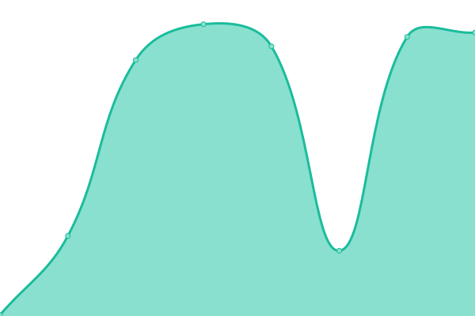
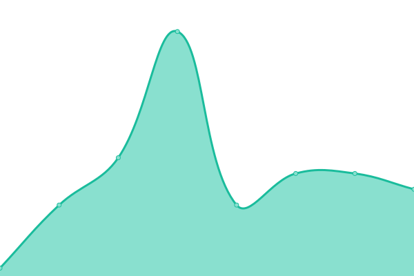
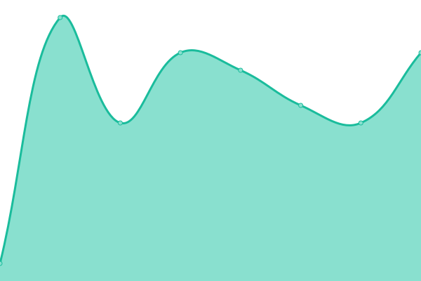

# [📈 Live Status](https://NekoGamesRepo.github.io/status): <!--live status--> **🟩 All systems operational**

This repository contains the open-source uptime monitor and status page for [NekoGamesRepo](https://NekoGamesRepo.github.io/status), powered by [Upptime](https://github.com/upptime/upptime).

With [Upptime](https://upptime.js.org), you can get your own unlimited and free uptime monitor and status page, powered entirely by a GitHub repository. We use [Issues](https://github.com/NekoGamesRepo/status/issues) as incident reports, [Actions](https://github.com/NekoGamesRepo/status/actions) as uptime monitors, and [Pages](https://NekoGamesRepo.github.io/status) for the status page.

<!--start: status pages-->
<!-- This summary is generated by Upptime (https://github.com/upptime/upptime) -->
<!-- Do not edit this manually, your changes will be overwritten -->
<!-- prettier-ignore -->
| URL | Status | History | Response Time | Uptime |
| --- | ------ | ------- | ------------- | ------ |
|  [Pachinko](https://redirector32.valueactive.eu/Casino/Default.aspx?applicationid=4023&sext1=demo&sext2=demo&serverid=22619&gameid=Pachinko&ul=en&variant=UAT-demo) | 🟩 Up | [pachinko.yml](https://github.com/NekoGamesRepo/status/commits/HEAD/history/pachinko.yml) | 

 496ms
     
 | 

<a href="https://NekoGamesRepo.github.io/status/history/pachinko">100.00%</a>
    

|  [Showball](https://redirector32.valueactive.eu/Casino/Default.aspx?applicationid=4023&sext1=demo&sext2=demo&serverid=22619&gameid=SuperShowball&ul=en&variant=UAT-demo) | 🟩 Up | [showball.yml](https://github.com/NekoGamesRepo/status/commits/HEAD/history/showball.yml) | 

 115ms
     
 | 

<a href="https://NekoGamesRepo.github.io/status/history/showball">100.00%</a>
    

|  [Fu 88](https://redirector32.valueactive.eu/Casino/Default.aspx?applicationid=4023&sext1=demo&sext2=demo&serverid=22619&gameid=Fu88&ul=en&variant=UAT-demo) | 🟩 Up | [fu-88.yml](https://github.com/NekoGamesRepo/status/commits/HEAD/history/fu-88.yml) | 

 115ms
     
 | 

<a href="https://NekoGamesRepo.github.io/status/history/fu-88">100.00%</a>
    

|  [Bingote](https://redirector32.valueactive.eu/Casino/Default.aspx?applicationid=4023&sext1=demo&sext2=demo&serverid=22619&gameid=Bingote&ul=en&variant=UAT-demo) | 🟩 Up | [bingote.yml](https://github.com/NekoGamesRepo/status/commits/HEAD/history/bingote.yml) | 

 115ms
     
 | 

<a href="https://NekoGamesRepo.github.io/status/history/bingote">100.00%</a>
    

|  [Golden Quest](https://redirector32.valueactive.eu/Casino/Default.aspx?applicationid=4023&sext1=demo&sext2=demo&serverid=22619&gameid=1524GoldenQuest&ul=en&variant=UAT-demo) | 🟩 Up | [golden-quest.yml](https://github.com/NekoGamesRepo/status/commits/HEAD/history/golden-quest.yml) | 

 115ms
     
 | 

<a href="https://NekoGamesRepo.github.io/status/history/golden-quest">100.00%</a>
    

|  [Immortal Romance](https://redirector32.valueactive.eu/Casino/Default.aspx?applicationid=4023&sext1=demo&sext2=demo&serverid=22619&gameid=ImmortalRomanceVideoBingo&ul=en&variant=UAT-demo) | 🟩 Up | [immortal-romance.yml](https://github.com/NekoGamesRepo/status/commits/HEAD/history/immortal-romance.yml) | 

 115ms
     
 | 

<a href="https://NekoGamesRepo.github.io/status/history/immortal-romance">100.00%</a>
    

<!--end: status pages-->

[**Visit our status website →**](https://NekoGamesRepo.github.io/status)

## 📄 License

- Powered by: [Upptime](https://github.com/upptime/upptime)
- Code: [MIT](./LICENSE) © [NekoGamesRepo](https://NekoGamesRepo.github.io/status)
- Data in the `./history` directory: [Open Database License](https://opendatacommons.org/licenses/odbl/1-0/)
